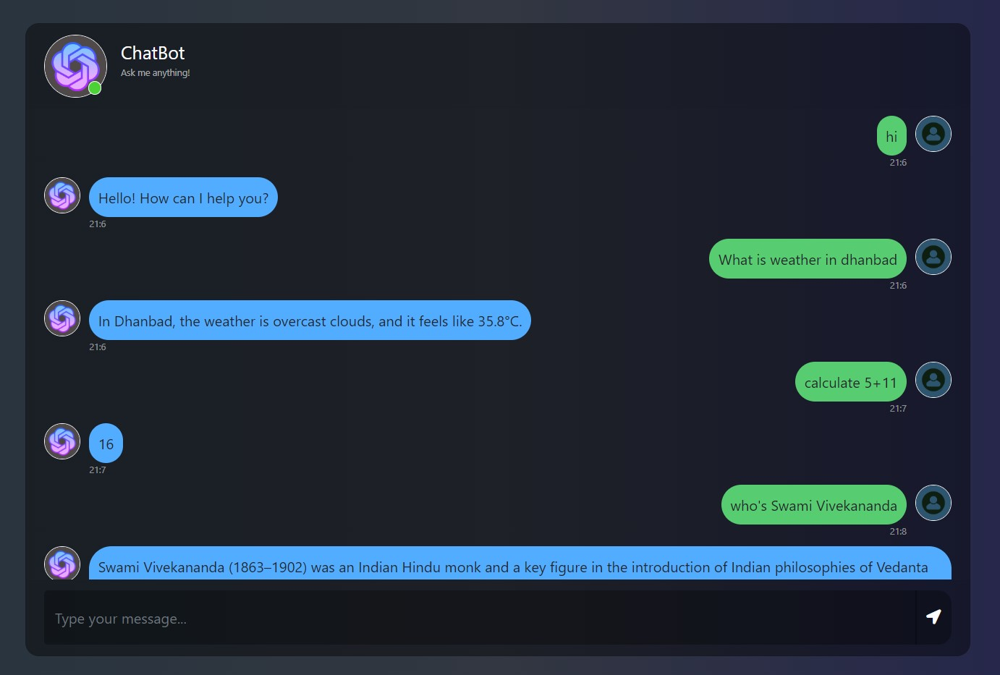

# ChatBot
This ChatBot can carry out conversations with users using natural language processing. This chatbot can answer in four different ways.
1. Give you temperature and weather condition of a city.
2. Solve Basic Math questions.
3. Respond based on internat intents. i.e. questions like "who are you", "who is your creator", etc.
4. If asked question is not matching with any of the above three, chatbot will try to give answer based on Wikipedia.

## Packages
flask<br />
nltk<br />
numpy<br />
tensorflow<br />
wolfromalpha<br />
wikipedia<br />
requests<br />

## Running ChatBot Application in Terminal
```
cd into your directory
```
```
python app.py
```
# ChatBot Link
```
https://chatbot.arunmishra8.repl.co/
```

# Note:
There are some issues with the chatbot, so when you ask questions you need to enter questions in a certain way.<br />
If you want to ask "What is Mango". <br />
You should enter<br />
"What's Mango"<br />
Because while training the model I used  stemming, which is converting the word "is" to "i", and "i" is present in intents.json so you will always get responses according to welcome intent.<br />

# Thank You
